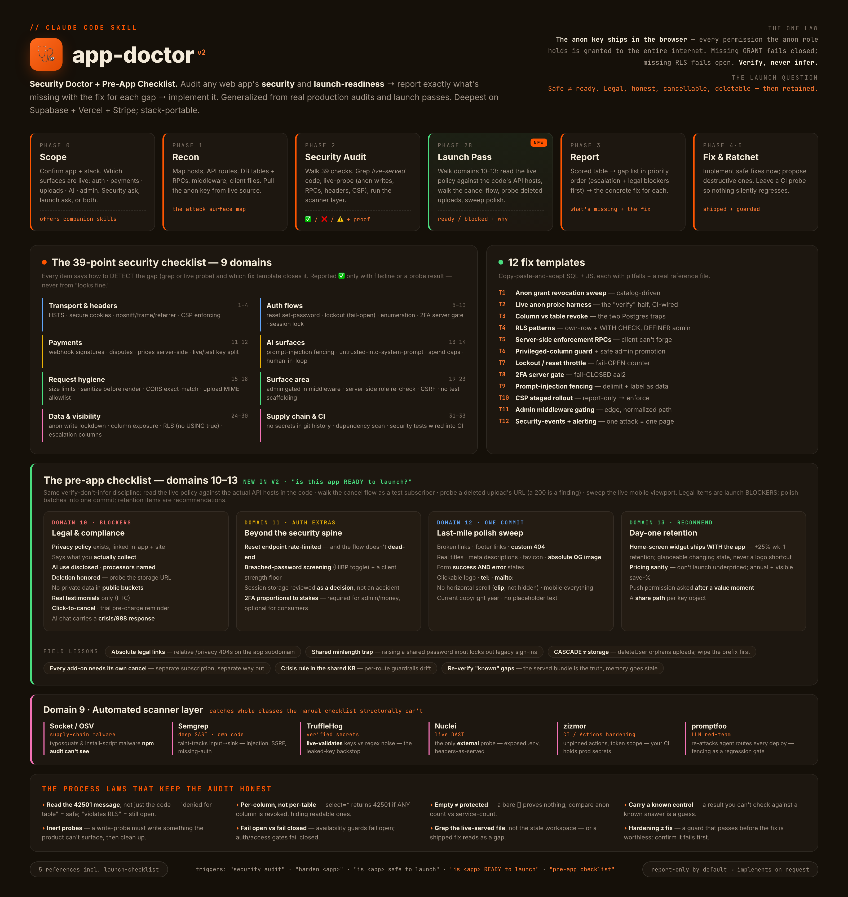

# 🛡️ App Doctor — Security Doctor + Pre-App Checklist

> Formerly **security-doctor** — the security half is unchanged; a launch-readiness half is new. Old links redirect.

**A Claude Code / agent skill that audits any web app's security AND launch-readiness, tells you exactly what's missing with the fix for each gap, and implements the fixes.**

Most "security checklists" are lists of things to worry about. Security Doctor is different: every one of its 39 checks (33 manual + a 6-tool automated scanner layer) tells the agent **how to detect the gap in your actual codebase** (a grep pattern or a live probe against your running app), **which fix closes it** (one of 12 copy-paste SQL/JS templates), and **how to verify the fix actually landed** — so you get a scored report backed by evidence, not vibes.

It's deepest on the **Supabase + Vercel + Stripe** stack (where a browser-shipped anon key makes every database permission a public one), but the underlying laws are stack-portable.



---

## Why it exists

If your frontend talks to Supabase with a publishable/anon key, that key is in your page source — which means **every permission the `anon` role holds, the entire internet holds.** A lock icon in your UI is a suggestion; the real gate is at the database and the API. Most apps ship with holes here that never show up in normal use: anon-writable tables, `SECURITY DEFINER` functions callable by strangers, admin gates keyed on a client-editable field, a CSP that looks fine until a feature quietly dies.

Security Doctor was distilled from real production audits into a single reusable skill so you don't have to re-learn each of these the hard way.

## What it checks (39 points, 9 domains)

| Domain | Examples |
|---|---|
| **Transport & headers** | HSTS, secure cookies, `nosniff`/frame/referrer, CSP enforcing (no `unsafe-inline`) |
| **Auth flows** | password-reset actually offers a set-password screen, login lockout (fail-**open**), user enumeration, 2FA server gate (fail-**closed**), session robustness |
| **Payments** | webhook signatures, dispute handling, prices computed server-side, live/test key split |
| **AI surfaces** | prompt-injection fencing, untrusted-text-into-system-prompt, usage & spend caps, human-in-the-loop |
| **Request hygiene** | size limits, sanitize-before-render, exact-match CORS, upload MIME allowlist |
| **Surface area** | admin gated in middleware, server-side role re-check, strip test scaffolding, CSRF |
| **Data & visibility** | anon write lockdown, column-level exposure, RLS (no `USING(true)`), `SECURITY DEFINER` RPC revoke, privilege-escalation columns |
| **Supply chain & CI** | no secrets in git history, dependency scan, security tests wired into CI |

## The launch-readiness pass (domains 10–13)

Security says "can this app be hacked?" — the pre-app checklist asks **"is this app ready to launch?"** Four more domains in [`references/launch-checklist.md`](references/launch-checklist.md), run with the same verify-don't-infer discipline:

- **10 · Legal & compliance** — privacy policy exists and matches reality (data collected, AI use disclosed, third-party processors named), deletion promises actually honored (probe the storage URL), no private data in public buckets, no fabricated testimonials, cancellation as easy as signup, trial auto-renew reminders, AI chat surfaces carry a self-harm/crisis response.
- **11 · Auth hardening extras** — rate-limited password reset (and a reset flow that doesn't dead-end), breached-password screening, session-storage reviewed as a decision, 2FA proportional to stakes.
- **12 · Last-mile polish** — the 20-minute sweep: broken links, favicon/OG, titles/meta, custom 404, form success/error states, clickable tel:/mailto:, no horizontal scroll, mobile everything.
- **13 · Day-one retention & commercial readiness** — glanceable home-screen widget shipping WITH the app, pricing sanity, contextual push prompt, share paths.

Field lessons from real launch passes (absolute legal links across subdomains, the shared-minlength lockout trap, CASCADE-vs-storage orphans, per-add-on click-to-cancel) are at the bottom of the file.

## The App Doctor Score

Every audit ends with **one number out of 100** — how much was already set up before the audit walked in. 74 checks summing to exactly 100 points: 🔴 the 14 criticals (exploitable-now / sue-now) are 4 points each (56), 🟡 the 40 important hardening checks are 1 point each (40), 🟢 the 20-item polish sweep shares a 4-point bucket; N/A items (no payments, no AI) rescale within their tier so every audit is still out of 100 and features you don't have never count against you. Two honesty caps keep the number from flattering: any open security critical caps the score at **49**, an open legal blocker caps it at **69** — an app leaking data doesn't get to score 80 on neatness. 90+ means you barely needed the audit; below 50 means the fix pass is the point.

## The 12 fix templates

Copy-paste-and-adapt SQL + JS, each with its pitfalls:

1. Anon grant revocation sweep (catalog-driven, not hand-typed)
2. Live anon probe harness (the "verify" half, CI-wired)
3. Column-vs-table revoke (the two Postgres traps)
4. RLS policy patterns (own-row + `WITH CHECK`, admin-via-`DEFINER`)
5. Server-side enforcement RPCs (privileged writes the client can't forge)
6. Privileged-column guard trigger + safe admin promotion
7. Login-lockout / reset-throttle guard (fail-**open** counter)
8. 2FA server gate (fail-**closed** aal2 enforcement)
9. Prompt-injection fencing (delimit + label untrusted text as data)
10. CSP staged rollout (report-only → collect → enforce) + inline-handler removal
11. Admin middleware host gating (edge, normalized pathname)
12. Security-events table + alerting (one attack = one page)

## The scanner layer (domain 9)

The 33 manual checks are things you verify by hand or live probe. The scanner layer is the **automated tools that catch whole classes the manual pass structurally can't see** — supply-chain malware, your own code's taint paths, live external exposure, CI-workflow attack surface. Run them as part of every audit; wire the cheap ones into CI as a ratchet. Full install + commands in [`references/tooling.md`](references/tooling.md).

| Tool | Catches what nothing else does |
|---|---|
| **Socket / OSV** | Supply-chain malware — typosquats, hijacked packages, malicious install scripts. `npm audit` only knows *disclosed CVEs*; this is the class it's structurally blind to. |
| **Semgrep CE** | Deep SAST on **your own code** — taint-tracks user input → sink (injection, SSRF, a route missing its auth check). |
| **TruffleHog** | **Verified** secrets — live-validates keys (logs into the provider) vs a regex scanner's noise. A leaked service-role key bypasses all your row-security work. |
| **Nuclei** | Live DAST — the only *external* probe of the deployed app: exposed `.env`, exposed DB-studio, headers/CSP verified as *served from the edge*. |
| **zizmor** | CI / GitHub Actions hardening — unpinned actions, expression injection, over-broad `GITHUB_TOKEN`. Once you run security in CI, your CI *is* attack surface. |
| **promptfoo** | LLM red-team — re-attacks your agent routes every deploy so a prompt edit can't silently reopen the fencing. Turns manual fencing into a regression gate. |

A scanner result still obeys *verify, never infer*: read the findings, carry a known control, and **never trust a CRITICAL from a heuristic scanner on a *security* tool without reading the code** — a security tool and a security threat share vocabulary, so scanners routinely flag a security skill's own threat catalog as malicious.

## The process laws that keep the audit honest

The reason most self-audits produce false all-clears is a handful of subtle traps. Security Doctor bakes the counters in:

- **Read the `42501` message, not just the code** — `permission denied for table` = safe; `violates row-level security` = still open.
- **Per-column, not per-table** — `select=*` returns `42501` if *any* column is revoked, hiding the readable ones.
- **Empty ≠ protected** — a bare `[]` proves nothing; compare anon-count vs service-role-count.
- **Carry a known control** — a scanner result you can't check against an answer you already know is a guess.
- **Inert probes** — a write-probe must write something the product can't surface, then clean up.
- **Grep the live-served file, not a stale checkout** — or a shipped fix reads as a gap.
- **Fail open vs fail closed** — availability guards fail open; auth/access gates fail closed.
- **Hardening ≠ fix** — a guard that passes *before* the fix is worthless; confirm it fails first.

## How it works

```
Scope → Recon → Audit → Report → Fix & Ratchet
```

0. **Scope** — confirm the stack and which surfaces are live (auth / payments / uploads / AI / admin); skip inapplicable sections honestly.
1. **Recon** — map hosts, API routes, DB tables + RPCs, middleware; pull the anon key from live source; get real column types from PostgREST.
2. **Audit** — walk all 39 checks, grepping the *live-served* code, live-probing, **and** running the scanner layer; record `✅ / ❌ / ⚠️` with evidence per item.
3. **Report** — a scored table, then the gap list in priority order (unauthenticated escalation + live data leaks first), each with the concrete fix.
4. **Fix** — implement the safe, reversible fixes in the same pass; propose destructive/broad ones with the exact migration.
5. **Ratchet** — leave a CI probe so the fix can't silently regress (a guard that passes before the fix is worthless).

It defaults to **report-only** when you're just asking "is this safe?" and implements when you ask it to.

## Install

Drop the skill into your agent's skills directory:

```bash
git clone https://github.com/<owner>/app-doctor.git ~/.claude/skills/app-doctor
```

(Works with any harness that loads a `SKILL.md` + `references/` folder. The path above is the Claude Code convention; adjust for your setup.)

## Use

Just ask your agent, in a repo:

- `security audit`
- `harden this app`
- `is this safe to launch?`
- `run the security checklist`
- `is this app ready to launch?` / `run the pre-app checklist`

The skill loads its checklist, runs the loop above, and hands you the scored report.

## Repo layout

```
SKILL.md                      # the workflow the agent follows
references/
  checklist.md                # the 39-item scored checklist (detect + fix-ref per item)
  tooling.md                  # the scanner layer — Semgrep, TruffleHog, Nuclei, zizmor, Socket, promptfoo
  fix-templates.md            # 12 copy-paste-and-adapt SQL/JS fixes, with pitfalls
  knowledge-base.md           # the "why" behind every check, grouped by theme
  launch-checklist.md         # the pre-app / launch-readiness pass (domains 10-13)
app-doctor-map.png            # one-page visual of the whole skill
```

## Scope & honesty

This is defense-oriented. The live-probe patterns are deliberately **inert** — they read denial codes and write only rows the product can't surface, then clean up. Run it against apps you own or are authorized to test. It won't catch everything (no tool does), but it turns "I think we're fine" into an evidence-backed answer, and it closes the specific classes of holes that this stack ships with by default.

## License

MIT — see [LICENSE](LICENSE).
