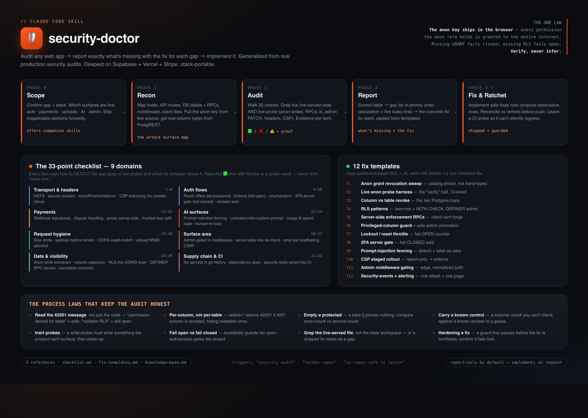

# 🛡️ Security Doctor

**A Claude Code / agent skill that audits any web app's security, tells you exactly what's missing with the fix for each gap, and implements the fixes.**

Most "security checklists" are lists of things to worry about. Security Doctor is different: every one of its 33 checks tells the agent **how to detect the gap in your actual codebase** (a grep pattern or a live probe against your running app), **which fix closes it** (one of 12 copy-paste SQL/JS templates), and **how to verify the fix actually landed** — so you get a scored report backed by evidence, not vibes.

It's deepest on the **Supabase + Vercel + Stripe** stack (where a browser-shipped anon key makes every database permission a public one), but the underlying laws are stack-portable.



---

## Why it exists

If your frontend talks to Supabase with a publishable/anon key, that key is in your page source — which means **every permission the `anon` role holds, the entire internet holds.** A lock icon in your UI is a suggestion; the real gate is at the database and the API. Most apps ship with holes here that never show up in normal use: anon-writable tables, `SECURITY DEFINER` functions callable by strangers, admin gates keyed on a client-editable field, a CSP that looks fine until a feature quietly dies.

Security Doctor was distilled from real production audits into a single reusable skill so you don't have to re-learn each of these the hard way.

## What it checks (33 points, 9 domains)

| Domain | Examples |
|---|---|
| **Transport & headers** | HSTS, secure cookies, `nosniff`/frame/referrer, CSP enforcing (no `unsafe-inline`) |
| **Auth flows** | password-reset actually offers a set-password screen, login lockout (fail-**open**), user enumeration, 2FA server gate (fail-**closed**), session robustness |
| **Payments** | webhook signatures, dispute handling, prices computed server-side, live/test key split |
| **AI surfaces** | prompt-injection fencing, untrusted-text-into-system-prompt, usage & spend caps, human-in-the-loop |
| **Request hygiene** | size limits, sanitize-before-render, exact-match CORS, upload MIME allowlist |
| **Surface area** | admin gated in middleware, server-side role re-check, strip test scaffolding, CSRF |
| **Data & visibility** | anon write lockdown, column-level exposure, RLS (no `USING(true)`), `SECURITY DEFINER` RPC revoke, privilege-escalation columns |
| **Supply chain & CI** | no secrets in git history, dependency scan, security tests wired into CI |

## The 12 fix templates

Copy-paste-and-adapt SQL + JS, each with its pitfalls:

1. Anon grant revocation sweep (catalog-driven, not hand-typed)
2. Live anon probe harness (the "verify" half, CI-wired)
3. Column-vs-table revoke (the two Postgres traps)
4. RLS policy patterns (own-row + `WITH CHECK`, admin-via-`DEFINER`)
5. Server-side enforcement RPCs (privileged writes the client can't forge)
6. Privileged-column guard trigger + safe admin promotion
7. Login-lockout / reset-throttle guard (fail-**open** counter)
8. 2FA server gate (fail-**closed** aal2 enforcement)
9. Prompt-injection fencing (delimit + label untrusted text as data)
10. CSP staged rollout (report-only → collect → enforce) + inline-handler removal
11. Admin middleware host gating (edge, normalized pathname)
12. Security-events table + alerting (one attack = one page)

## The process laws that keep the audit honest

The reason most self-audits produce false all-clears is a handful of subtle traps. Security Doctor bakes the counters in:

- **Read the `42501` message, not just the code** — `permission denied for table` = safe; `violates row-level security` = still open.
- **Per-column, not per-table** — `select=*` returns `42501` if *any* column is revoked, hiding the readable ones.
- **Empty ≠ protected** — a bare `[]` proves nothing; compare anon-count vs service-role-count.
- **Carry a known control** — a scanner result you can't check against an answer you already know is a guess.
- **Inert probes** — a write-probe must write something the product can't surface, then clean up.
- **Grep the live-served file, not a stale checkout** — or a shipped fix reads as a gap.
- **Fail open vs fail closed** — availability guards fail open; auth/access gates fail closed.
- **Hardening ≠ fix** — a guard that passes *before* the fix is worthless; confirm it fails first.

## How it works

```
Scope → Recon → Audit → Report → Fix & Ratchet
```

0. **Scope** — confirm the stack and which surfaces are live (auth / payments / uploads / AI / admin); skip inapplicable sections honestly.
1. **Recon** — map hosts, API routes, DB tables + RPCs, middleware; pull the anon key from live source; get real column types from PostgREST.
2. **Audit** — walk all 33 checks, grepping the *live-served* code **and** live-probing; record `✅ / ❌ / ⚠️` with evidence per item.
3. **Report** — a scored table, then the gap list in priority order (unauthenticated escalation + live data leaks first), each with the concrete fix.
4. **Fix** — implement the safe, reversible fixes in the same pass; propose destructive/broad ones with the exact migration.
5. **Ratchet** — leave a CI probe so the fix can't silently regress (a guard that passes before the fix is worthless).

It defaults to **report-only** when you're just asking "is this safe?" and implements when you ask it to.

## Install

Drop the skill into your agent's skills directory:

```bash
git clone https://github.com/<owner>/security-doctor.git ~/.claude/skills/security-doctor
```

(Works with any harness that loads a `SKILL.md` + `references/` folder. The path above is the Claude Code convention; adjust for your setup.)

## Use

Just ask your agent, in a repo:

- `security audit`
- `harden this app`
- `is this safe to launch?`
- `run the security checklist`

The skill loads its checklist, runs the loop above, and hands you the scored report.

## Repo layout

```
SKILL.md                      # the workflow the agent follows
references/
  checklist.md                # the 33-item scored checklist (detect + fix-ref per item)
  fix-templates.md            # 12 copy-paste-and-adapt SQL/JS fixes, with pitfalls
  knowledge-base.md           # the "why" behind every check, grouped by theme
security-doctor-map.png       # one-page visual of the whole skill
```

## Scope & honesty

This is defense-oriented. The live-probe patterns are deliberately **inert** — they read denial codes and write only rows the product can't surface, then clean up. Run it against apps you own or are authorized to test. It won't catch everything (no tool does), but it turns "I think we're fine" into an evidence-backed answer, and it closes the specific classes of holes that this stack ships with by default.

## License

MIT — see [LICENSE](LICENSE).
